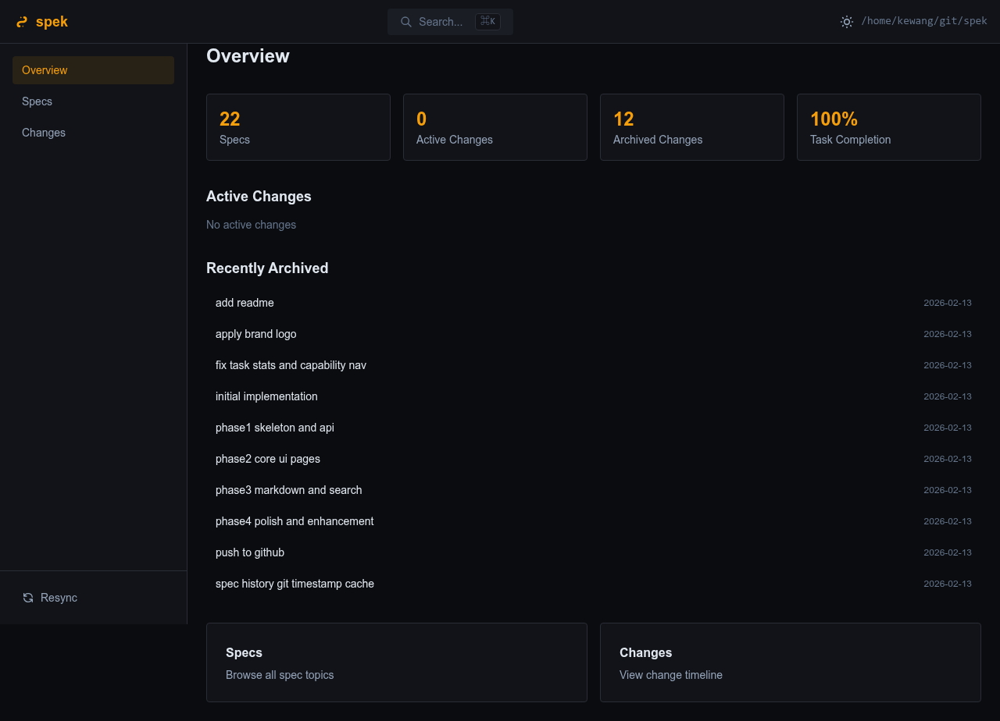
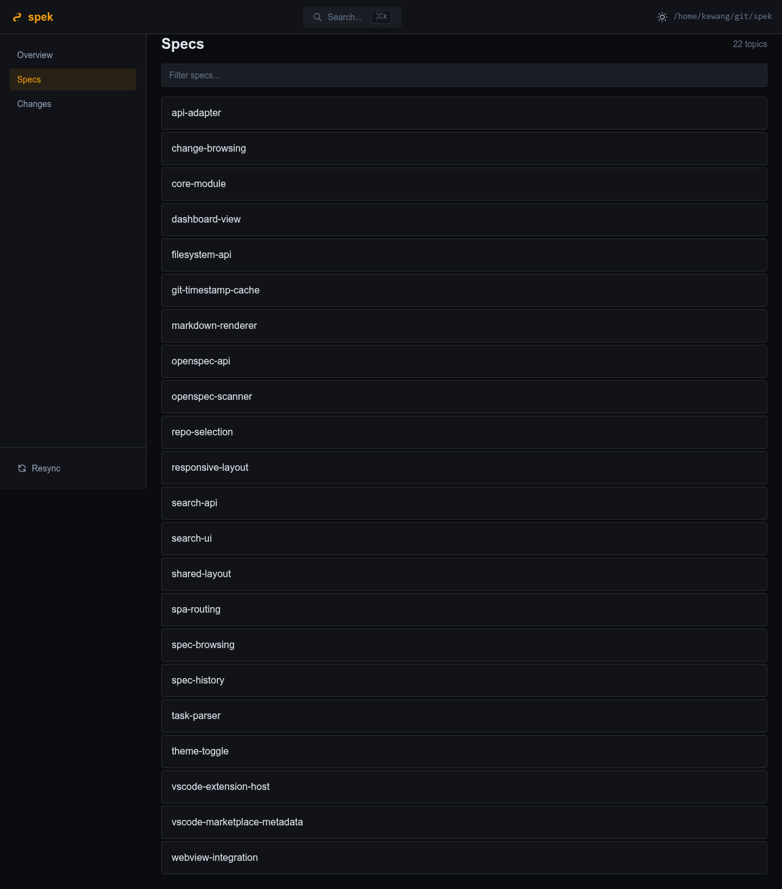
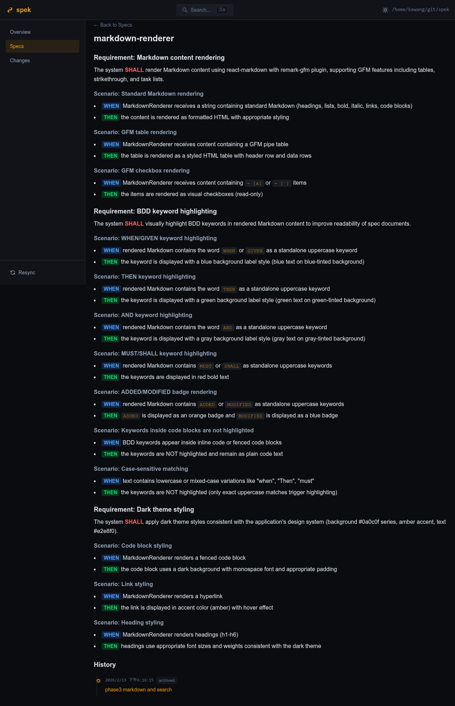
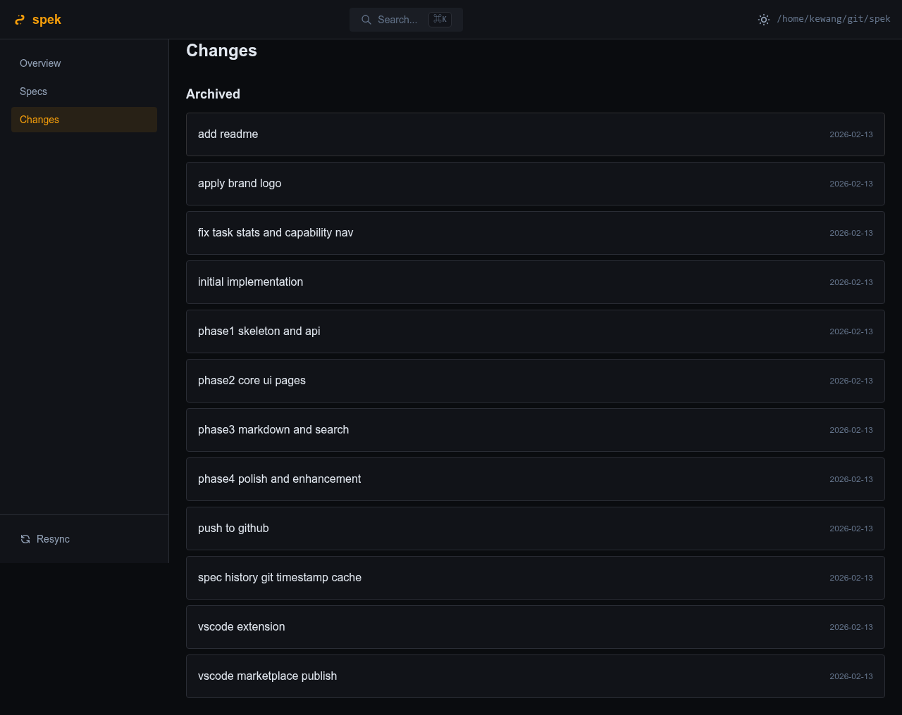
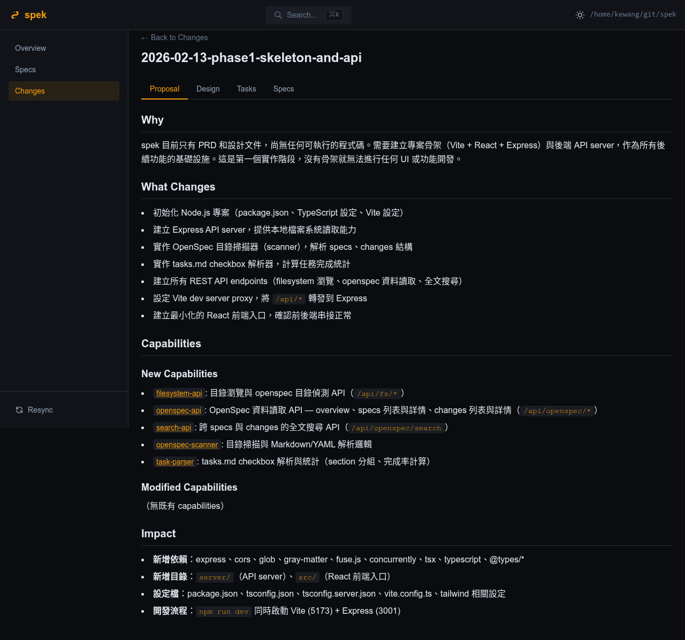
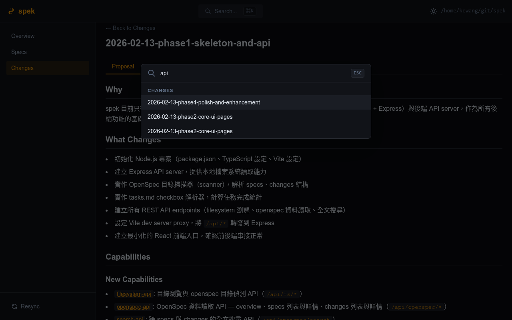

<p align="center">
  
</p>

<p align="center">
  A lightweight, read-only viewer for <a href="https://github.com/Fission-AI/OpenSpec">OpenSpec</a> content — browse specs, changes, and tasks with structure.
</p>

**[繁體中文](README.zh-TW.md)**

---

## What is spek?

**spek** turns your local OpenSpec directory into a navigable, searchable interface. Instead of reading raw Markdown files in a text editor, spek provides structured browsing with BDD syntax highlighting, task progress tracking, and full-text search.

**[Live Demo](https://kewang.github.io/spek/demo.html)** — Try it instantly in your browser, no install needed.

Available in two forms:

- **Web** — Local Express + React app, accessible in any browser
- **VS Code Extension** — Integrated Webview Panel within your editor

Both are **read-only** and **local-only**. No server deployment, no authentication, no data leaves your machine.

## Features

- **Dashboard** — Overview of specs count, changes count, and task completion rates
- **Specs Browser** — Alphabetical listing with detail view and revision history
- **Changes Timeline** — Active and archived changes with tabbed views (Proposal / Design / Tasks / Specs)
- **BDD Syntax Highlighting** — Visual distinction for WHEN/GIVEN, THEN, AND, MUST/SHALL keywords
- **Task Progress** — Checkbox parsing with section-grouped progress bars
- **Full-text Search** — `Cmd+K` / `Ctrl+K` to search across all specs and changes
- **Dark / Light Theme** — Toggle between themes; dark by default
- **Spec History** — Git-based timestamp tracking for spec revisions
- **Responsive Layout** — Works on various screen sizes

## Screenshots

### Dashboard
Overview of specs count, changes count, and task completion rates.



### Specs Browser
Alphabetical listing of all spec topics with filter support.



### Spec Detail with BDD Highlighting
Visual distinction for BDD keywords — WHEN/GIVEN (blue), THEN (green), AND (gray), MUST/SHALL (red).



### Changes Timeline
Active and archived changes listed chronologically.



### Change Detail
Tabbed view with Proposal, Design, Tasks, and Specs sections.



### Full-text Search
`Cmd+K` / `Ctrl+K` to search across all specs and changes.



## Quick Start

### Web Version

```bash
git clone https://github.com/kewang/spek.git
cd spek
npm install
npm run dev
```

Open http://localhost:5173, enter a path to a repo containing an `openspec/` directory, and start browsing.

### VS Code Extension

Install from the [Visual Studio Marketplace](https://marketplace.visualstudio.com/items?itemName=kewang.spek-vscode). The extension activates automatically when your workspace contains `openspec/config.yaml`.

**Commands:**
- `spek: Open spek` — Open the viewer panel
- `spek: Search OpenSpec` — Open search dialog

## OpenSpec Directory Structure

spek expects the following structure under your repository:

```
{repo}/openspec/
├── config.yaml
├── specs/
│   └── {topic}/
│       └── spec.md              # BDD-formatted specification
└── changes/
    ├── {active-change}/         # In-progress changes
    │   ├── .openspec.yaml
    │   ├── proposal.md
    │   ├── design.md
    │   ├── tasks.md
    │   └── specs/               # Delta specs for this change
    └── archive/
        └── {YYYY-MM-DD-desc}/   # Archived changes (same structure)
```

## Architecture

### Monorepo Structure

```
packages/
├── core/       # @spek/core — Pure logic (scanner, parser, types)
├── web/        # @spek/web — Express API + React SPA
└── vscode/     # spek-vscode — VS Code Extension
```

### API Adapter Pattern

The frontend communicates through an `ApiAdapter` interface with two implementations:

- **FetchAdapter** — Web version, calls Express REST API over HTTP
- **MessageAdapter** — VS Code version, uses `postMessage` IPC with the extension host

This allows the same React UI to run in both environments without code changes.

### Tech Stack

| Layer | Technology |
|-------|-----------|
| Core | TypeScript, Node.js |
| Frontend | React 19, Vite 6, Tailwind CSS v4, React Router v7 |
| Backend | Express 4 |
| Markdown | react-markdown, remark-gfm |
| Search | Fuse.js |
| Extension | VS Code Webview API, esbuild |

## Development

```bash
npm install              # Install all workspace dependencies
npm run dev              # Start Vite (5173) + Express (3001)
npm run build            # Build core + web
npm run build:core       # Build @spek/core only
npm run build:webview    # Build webview assets for VS Code extension
npm run build:vscode     # Build VS Code extension
npm run type-check       # TypeScript type check
```

**Requirements:** Node.js 22+

## License

MIT
